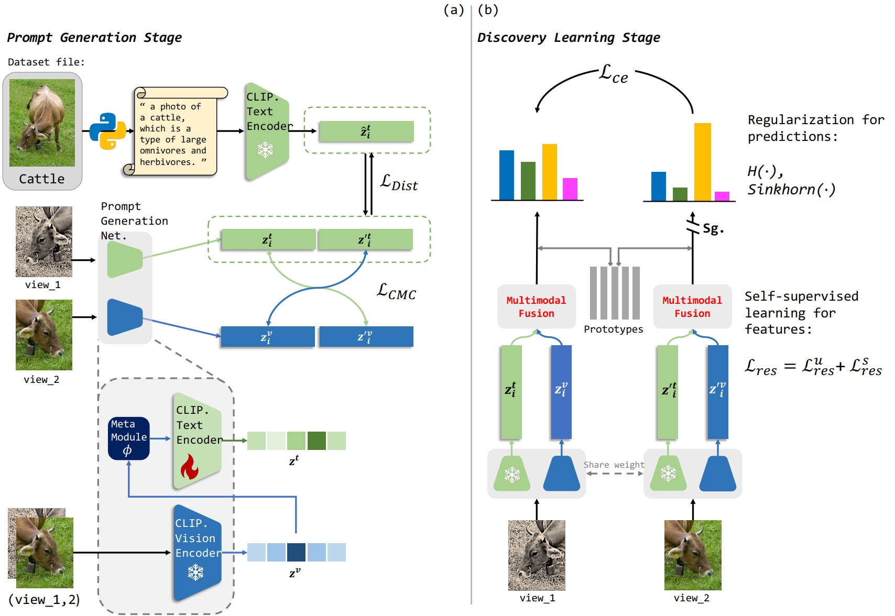
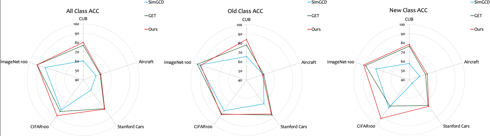

# ProGCD: Boosting Generalized Category Discovery with Conditional Prompt Learning

This is the PyTorch implementation of ProGCD.




Generalized Category Discovery (GCD) addresses a challenging open-world learning problem by leveraging limited prior knowledge in an unsupervised environment. The key objective is to effectively cluster novel samples while simultaneously classifying known but unlabeled samples. Existing approaches primarily focus on enhancing representation learning through single-modal contrastive methods, overlooking naturally available textual information. In image recognition tasks, visual and textual modalities provide complementary advantages. Visual features capture essential perceptual details like shapes, textures, and spatial relationships, whereas textual information helps distinguish between visually similar but semantically distinct categories. However, acquiring descriptions for unlabeled data through image-text pairs remains challenging due to the absence of class name information. To address this limitation, we introduce conditional prompt learning and enhance the Contrastive Language-Image Pre-training (CLIP) model to generate appropriate pseudo prompts as textual information. Our approach introduces three key innovations through a novel multimodal fusion method for enhanced sample representation, a self-distillation mechanism for generating high-quality pseudo labels with fusion features, and a Sinkhorn-Knopp regularizer to mitigate model bias from modalities fusion. Extensive experiments on standard datasets (CIFAR100, ImageNet-100) and fine-grained datasets (CUB, Stanford Cars, FGVC-Airplane) demonstrate that our Prompt-based GCD (ProGCD) method significantly outperforms state-of-the-art single-modal GCD methods while achieving leading performance among multimodal approaches.

## Running
### Dependencies
```shell
pip install -r requirments.txt
```
### Config
Set paths to datasets and desired log directories in `config.py`
### Training
#### 1. Prompt Generation Stage
1.1. Prepare prompts:
```shell
cd prompt_generation
python get_img_and_generate.py
python txt_to_pkl.py
python get_pth.py
```
1.2. Pre-training PGN:
```shell
python prompt_generation.py
```
#### 2. Discovery Learning Stage
```pgthon
bash ./scripts/run_${DATASET_NAME}.sh
```

## Result


Our results:
|    Dataset    |  All |  Old |  New |
|:-------------:|:----:|:----:|:----:|
| CIFAR100      | 87.7 | 86.2 | 90.7 |
| ImageNet100   | 91.9 | 92.0 | 91.7 |
| CUB           | 79.9 | 82.9 | 78.1 |
| Stanford Cars | 79.0 | 85.6 | 75.8 |
| FGVC-Aircraft | 59.6 | 58.2 | 60.4 |


## Acknowledgements
The codebase is heavily built on [Cocoop](https://github.com/KaiyangZhou/CoOp?tab=readme-ov-file) and [SimGCD](https://github.com/CVMI-Lab/SimGCD/edit/main/README.md). Thanks for their contribution!

