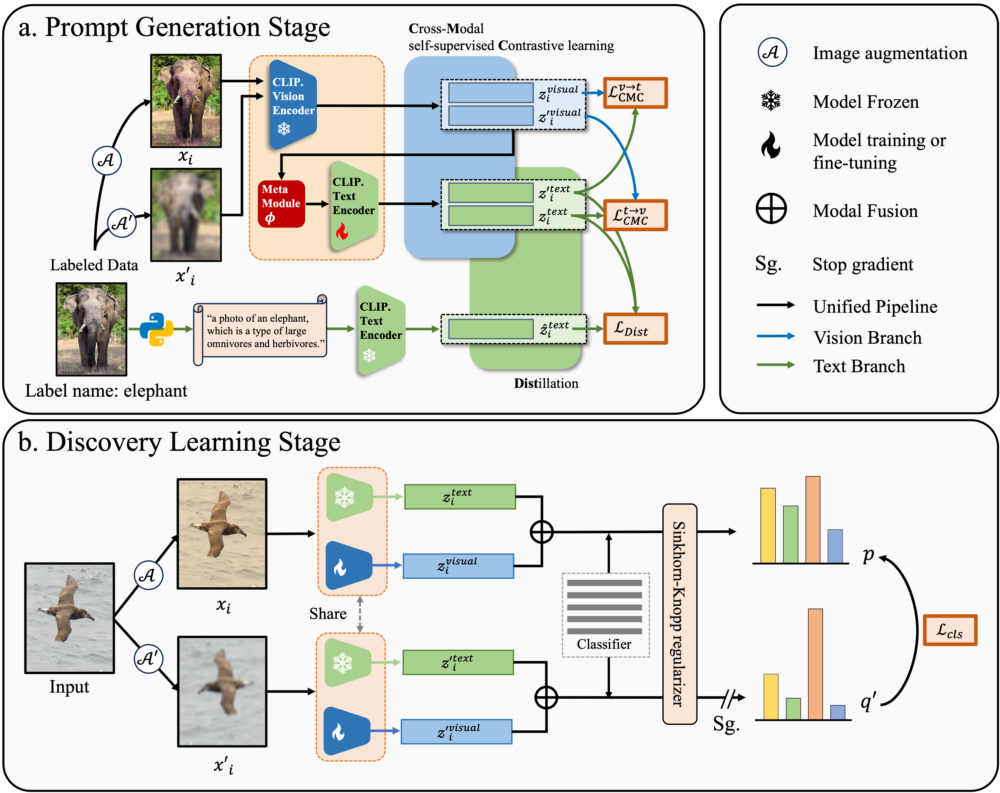
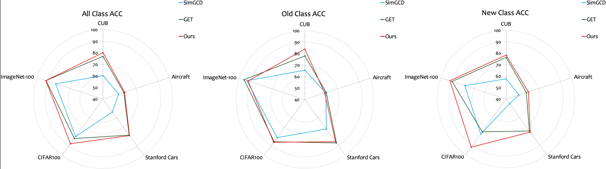

# Multimodal Self-Distillation for Enhanced Generalized Category Discovery

> **📄 Paper:** This repository contains the official implementation of the paper *"Multimodal Self-Distillation for Enhanced Generalized Category Discovery"*, submitted to **The Visual Computer** (Springer).



## Abstract

Generalized Category Discovery (GCD) presents a challenging open-world learning problem by clustering novel samples while classifying known but unlabeled samples with limited prior knowledge. Existing methods primarily focus on single-modal approaches, overlooking the complementary advantages of textual information. Recent multimodal methods have begun exploring text generation from visual features, yet rely solely on visual encoders during inference, discarding textual cues precisely when they are most needed for distinguishing novel categories. This paper introduces ProGCD, a multimodal self-distillation framework that preserves both visual and textual modalities throughout inference to enhance category discovery. Our approach employs a lightweight Prompt Generation Network to synthesize instance-specific pseudo-prompts through conditional prompt learning with supervised alignment and self-supervised cross-modal consistency, then fuses visual and textual features within a self-distillation framework. To address fusion-induced prediction bias toward known classes, we incorporate Sinkhorn-Knopp regularization, ensuring balanced category discovery while preserving discriminative signals. Extensive experiments on standard datasets (CIFAR100, ImageNet-100) and fine-grained datasets (CUB, Stanford Cars, FGVC-Aircraft) demonstrate that ProGCD significantly outperforms state-of-the-art single-modal methods and achieves competitive performance among multimodal approaches, with improvements of up to 7.6% on CIFAR100 and 19.4% on CUB.

## Results



|    Dataset    |  All |  Old |  New |
|:-------------:|:----:|:----:|:----:|
| CIFAR100      | 87.7 | 86.2 | 90.7 |
| ImageNet-100  | 91.9 | 92.0 | 91.7 |
| CUB           | 79.9 | 82.9 | 78.1 |
| Stanford Cars | 79.0 | 85.6 | 75.8 |
| FGVC-Aircraft | 59.6 | 58.2 | 60.4 |

## Installation

### Prerequisites

- Python >= 3.8
- PyTorch >= 1.12.0
- CUDA >= 11.3

### Setup

```bash
git clone https://github.com/xxx/ProGCD.git
cd ProGCD
pip install -r requirements.txt
```

### Pre-trained Model

Our method uses CLIP (ViT-B/16) as the backbone. Download the pre-trained CLIP model:

```bash
pip install git+https://github.com/openai/CLIP.git
```

## Dataset Preparation

Download the following datasets and update the paths in `config.py`:

| Dataset | Download Link |
|---------|--------------|
| CIFAR-100 | [Auto-downloaded by torchvision] |
| ImageNet-100 | [ImageNet](https://www.image-net.org/download.php) |
| CUB-200-2011 | [Caltech](https://www.vision.caltech.edu/datasets/cub-200-2011/) |
| Stanford Cars | [Stanford](http://imagenet.stanford.edu/internal/car196) |
| FGVC-Aircraft | [Oxford](https://www.robots.ox.ac.uk/~vgg/data/fgvc-aircraft/) |

After downloading, edit `config.py` to set the correct dataset paths:

```python
cifar_100_root = '/path/to/your/cifar100'
cub_root = '/path/to/your/CUB/'
car_root = '/path/to/your/Stanford_cars'
aircraft_root = '/path/to/your/FGVC_Aircraft'
imagenet_root = '/path/to/your/ImageNet100/ILSVRC12'
```

## Usage

### Stage 1: Prompt Generation

1. **Prepare text descriptions:**

```bash
cd prompt_generation
python get_img_and_generate.py --dataset_name cifar100
python txt_to_pkl.py
python get_pth.py
```

2. **Pre-train the Prompt Generation Network (PGN):**

```bash
python prompt_generation.py
```

The pre-trained PGN model will be saved to `./result/pretrained_model_save/`.

### Stage 2: Discovery Learning

Run the training script for the desired dataset:

```bash
# CIFAR-100
bash ./scripts/run_cifar100.sh

# ImageNet-100
bash ./scripts/run_imagenet100.sh

# CUB-200-2011
bash ./scripts/run_cub.sh

# Stanford Cars
bash ./scripts/run_cars.sh

# FGVC-Aircraft
bash ./scripts/run_aircraft.sh
```

### Key Hyperparameters

| Parameter | Description | Default |
|-----------|------------|---------|
| `--lr` | Learning rate | 0.1 |
| `--epochs` | Number of training epochs | 200 |
| `--batch_size` | Batch size | 128 |
| `--sinkhorn` | Sinkhorn-Knopp regularization coefficient (λ) | 0.1 |
| `--memax_weight` | Mean-entropy regularization coefficient (ε) | 1 or 2 |
| `--sup_weight` | Supervised loss weight (β) | 0.35 |

## Project Structure

```
ProGCD/
├── assets/                    # Figures for README
├── data/                      # Dataset loading and preprocessing
│   ├── augmentations/         # Data augmentation transforms
│   ├── cifar.py               # CIFAR-10/100 dataset loader
│   ├── cub.py                 # CUB-200-2011 dataset loader
│   ├── fgvc_aircraft.py       # FGVC-Aircraft dataset loader
│   ├── imagenet.py            # ImageNet-100 dataset loader
│   ├── stanford_cars.py       # Stanford Cars dataset loader
│   ├── get_datasets.py        # Unified dataset interface
│   └── data_utils.py          # Dataset utilities
├── prompt_generation/         # Stage 1: Prompt Generation
│   ├── get_img_and_generate.py
│   ├── txt_to_pkl.py
│   ├── get_pth.py
│   └── utils.py
├── scripts/                   # Training scripts for each dataset
├── config.py                  # Dataset paths and configurations
├── model.py                   # Model components (DINOHead, losses)
├── model_utils.py             # Fusion strategies and utilities
├── train.py                   # Main training script (Stage 2)
├── requirements.txt           # Python dependencies
└── README.md
```

## Citation

If you find this code useful for your research, please consider citing our paper:

```bibtex
@article{jin2025progcd,
  title={Multimodal Self-Distillation for Enhanced Generalized Category Discovery},
  author={Li, Nannan and Jin, Wei and Li, Kuo and  and Wang, Wenmin},
  journal={The Visual Computer},
  year={2025},
  publisher={Springer}
}
```

## Acknowledgements

This codebase is built upon [CoCoOp](https://github.com/KaiyangZhou/CoOp) and [SimGCD](https://github.com/CVMI-Lab/SimGCD). We thank the authors for their excellent work.

## License

This project is licensed under the MIT License - see the [LICENSE](LICENSE) file for details.
